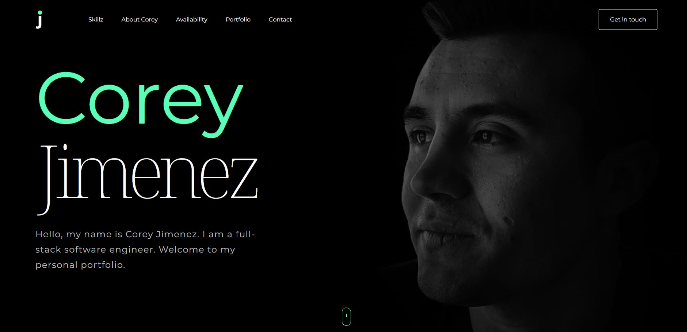
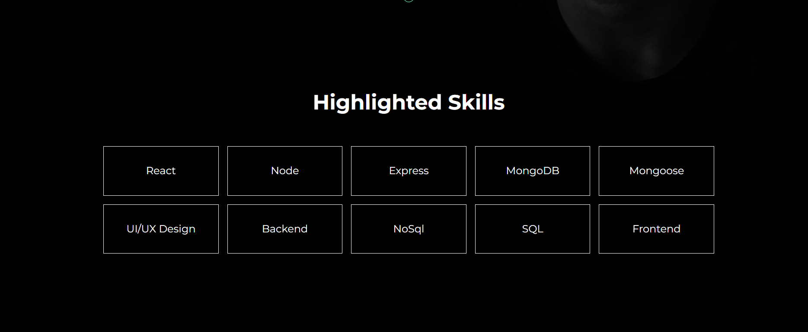
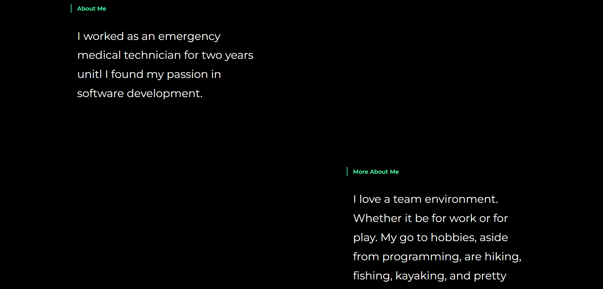
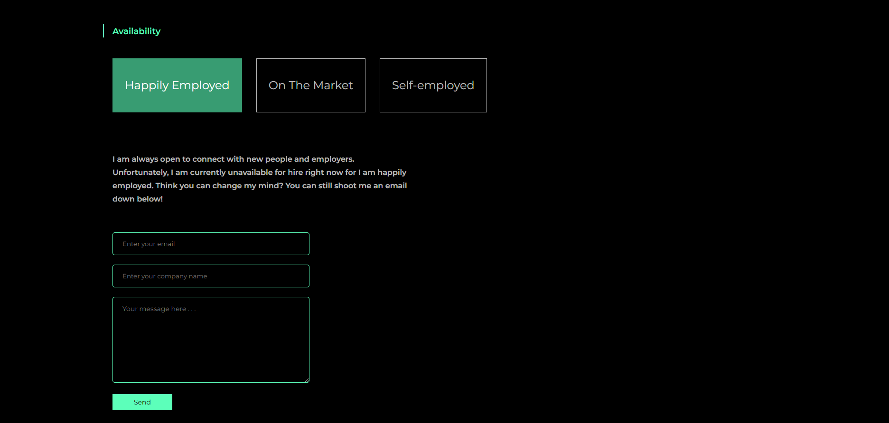
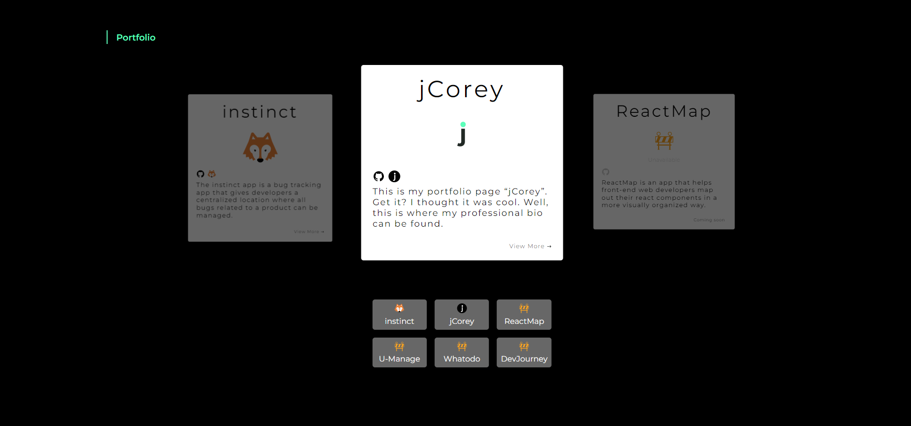
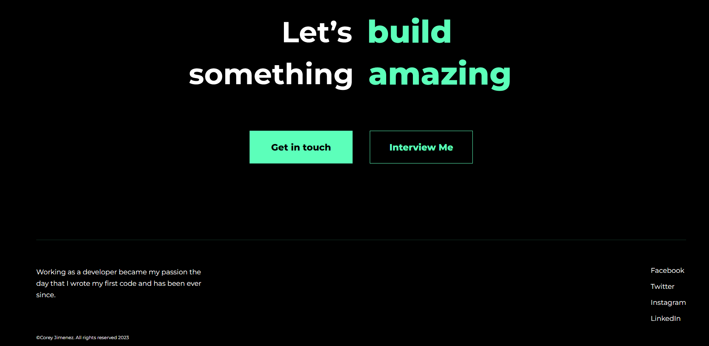

# **jCorey** - Corey Jimenez's Portfolio Site

## Libraries used

### `react`

This site is component based site built with reactjs library

### `reduxjs/toolkit react-redux`

Using redux toolkit for global state of the navigation and carousel. Could of used useContext for this funcionality but since I've been practicing with redux I figured I use redux toolkit.

### `Content`

## **jCorey** has a few a sections incuding:

- Skills — presenting the skills that I have
- About Corey — giving a little bio of myself
- Availability — showing my availability as an employee
- Portfolio — showcasing any projects that I've worked on
- Contact — allows for potential employers to contact me

## Images — Desktop versions

#### [Header Section:](https://640fabe5398ed826e3c09846--jcorey.netlify.app/)

#### [Skills Section:](https://640fabe5398ed826e3c09846--jcorey.netlify.app/#highlighted-skill)

#### [About Me Section:](https://640fabe5398ed826e3c09846--jcorey.netlify.app/#about-me)

#### [Availability Section:](https://640fabe5398ed826e3c09846--jcorey.netlify.app/#availability)

#### [Portfolio Section:](https://640fabe5398ed826e3c09846--jcorey.netlify.app/#portfolio)

#### [cta/footer Section:](https://640fabe5398ed826e3c09846--jcorey.netlify.app/#footer)

## Responsivness

This website if fully optimized for mobile use here is a link — [jCorey](https://640fabe5398ed826e3c09846--jcorey.netlify.app/)

## The future for this website:

- I will be adding portfolio projects as I complete them
- I will be adding more images of projects and more images of me as they come
- I will be adding links to all of the projects in my portfolio as soon as they are live
